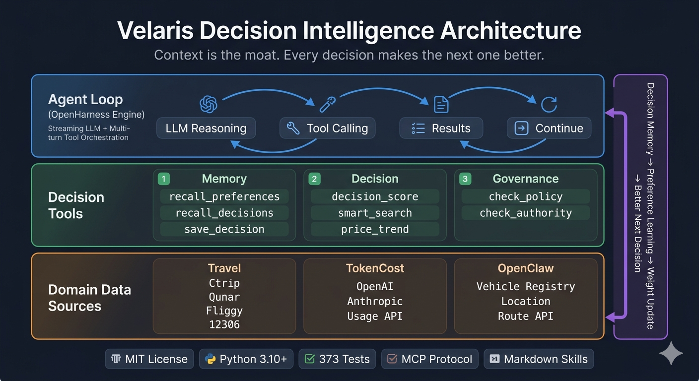

<h1 align="center">Velaris Agent</h1>

<p align="center"><strong>Decision Intelligence Agent - 让每次决策都比上一次更好</strong></p>

<p align="center">
  <a href="#-quick-start"></a>
  <a href="#-architecture"></a>
  <a href="#-decision-tools"></a>
  <a href="#-tests"></a>
  <a href="LICENSE"></a>
</p>

<p align="center">
  
  
  
  
  
</p>

---

## What is Velaris?

Velaris 不是一个评分函数, 是一个**会思考的决策 Agent**.

```
传统 agent: 用户提问 -> 调 API -> 返回结果 -> 忘掉一切
Velaris:    用户提问 -> 理解意图 -> 推理需要什么数据 -> 智能获取 ->
            参考历史决策 -> 个性化评分 -> 推荐+解释 -> 记录+学习
```

**核心理念**: Context 是护城河. 同样的 LLM, 谁的上下文更全谁的决策更准.

### 三个设计选择

| 载体 | 选择 | 理由 |
|------|------|------|
| **知识** | Markdown 文件 | 人和 AI 都能读写, 版本可控, 零依赖 |
| **工具集成** | MCP 协议 | 标准互操作, 不锁定供应商 |
| **运行时** | Python 3.10+ | AI/ML 生态最成熟, 类型安全 (Pydantic v2) |

### 三个产品场景

| 场景 | 核心价值 |
|------|----------|
| **商旅 AI 助手** | 机票酒店多平台比价 + 意图识别 + 一站式出行方案 |
| **AI TokenCost** | AI 使用成本优化, 识别浪费, 输出可执行降本方案 |
| **OpenClaw** | 车端开放智能体运行环境, 三段式派单协议 (意图订单 -> 服务提案 -> 可审计合约) |

---

## Architecture

<p align="center">
  
</p>

### 三层设计

**Layer 1: Agent Loop** - 基于 OpenHarness engine, 流式 LLM 推理 + 多轮工具调用编排. 不写死 pipeline, 让 LLM 自主决定调什么工具、调几次.

**Layer 2: Decision Tools** - 11 个专用决策工具:
- **记忆类**: 召回用户偏好、检索相似历史决策、保存决策全量记录
- **决策类**: 多维评分 (支持个性化权重)、智能搜索、价格趋势
- **治理类**: 合规检查、权限验证、审批流程

**Layer 3: Domain Data Sources** - 可插拔的场景数据源, Agent 自主决定查询哪些源、用什么参数.

### 数据飞轮

```
用户使用 -> 决策记录 -> 偏好学习 -> 权重更新 -> 推荐更准 -> 用户更愿意用
```

每次决策都被完整记录 (意图 + 选项 + 推荐 + 用户选择 + 满意度), PreferenceLearner 从实际选择中学习个性化权重. 用的人越多, 推荐越准.

---

## Quick Start

### 环境要求

- Python 3.10+
- [uv](https://github.com/astral-sh/uv) (推荐) 或 pip

### 安装

```bash
git clone https://github.com/jiaweifreshair/velaris-agent.git
cd velaris-agent
uv sync --extra dev
```

### 运行

```bash
# CLI 模式
velaris

# 短命令
vl

# 非交互模式
velaris -p "帮我查下周三北京到上海的机票"

# 指定模型
velaris --model claude-sonnet-4 -p "分析我的 API 成本"
```

### 配置

```bash
# API Key (必需)
export ANTHROPIC_API_KEY=your-key-here

# 可选: 自定义模型
export ANTHROPIC_MODEL=claude-sonnet-4

# 可选: 兼容其他提供商
export ANTHROPIC_BASE_URL=https://your-proxy/v1
```

---

## Decision Tools

### 记忆类

| 工具 | 说明 |
|------|------|
| `recall_preferences` | 召回用户历史偏好 - 个性化权重 + 行为模式 + 满意度 |
| `recall_decisions` | 检索相似历史决策 - "上次类似情况怎么选的, 结果如何" |
| `save_decision` | 保存完整决策快照 - 意图/选项/推荐/权重/工具调用 |

### 决策类

| 工具 | 说明 |
|------|------|
| `decision_score` | 多维加权评分 - 支持个性化权重自动切换 |
| `score_options` | 通用选项评分 (biz layer) |
| `biz_execute` | 业务闭环执行 (路由 -> 签权 -> 执行 -> 记录) |
| `biz_plan` | 能力规划 (场景识别 + 约束推理) |

### 治理类

| 工具 | 说明 |
|------|------|
| `travel_recommend` | 商旅比价推荐 |
| `tokencost_analyze` | AI 成本分析与优化 |
| `openclaw_dispatch` | OpenClaw 三段式调度 |

---

## Decision Memory

Velaris 的竞争壁垒: 每次决策都被完整记录, 用于未来学习.

```python
# 决策记录结构
DecisionRecord:
  decision_id     # 唯一 ID
  user_id         # 用户
  scenario        # 场景 (travel/tokencost/openclaw)
  query           # 原始意图
  options_discovered  # 发现的所有选项
  scores          # 评分结果
  weights_used    # 使用的权重 (可能是个性化的)
  recommended     # 系统推荐
  user_choice     # 用户最终选了什么 (反馈回填)
  user_feedback   # 满意度 0-5 (反馈回填)
```

### 偏好学习

```python
# PreferenceLearner 从用户实际选择中学习
# 用户连续5次选了最贵的舒适方案:
#   price 权重: 0.40 -> 0.22
#   comfort 权重: 0.25 -> 0.43
# 第6次直接推荐舒适方案
```

算法: 贝叶斯先验 + 指数衰减 (近期决策权重更大) + 归一化

---

## OpenClaw Protocol

三段式派单协议 - 从"黑箱匹配"到"可审计契约":

### Stage 1: IntentOrder (意图订单)

不是"我要一辆车", 而是完整的任务请求:

```python
IntentOrder:
  origin / destination      # 起终点
  time_requirements         # 时间要求 + 弹性
  service_preferences       # 车型/司机风格/拼车意愿
  budget                    # 预算 + 是否接受溢价
  privacy_level             # 隐私等级
  constraints               # 行李/儿童/老人/轮椅
  enterprise_identity       # 企业报销身份
  additional_services       # 附加服务需求
```

### Stage 2: ServiceProposal (服务提案)

每辆车返回结构化提案 (服务投标):

```python
ServiceProposal:
  eta / pricing             # ETA + 定价明细
  driver / vehicle          # 司机画像 + 车辆画像
  task_understanding_score  # 任务理解度
  historical_fulfillment    # 历史履约分
  commitment_boundaries     # 可承诺边界
  add_on_services           # 附加服务
```

### Stage 3: TransactionContract (可审计合约)

```python
TransactionContract:
  price_composition         # 价格组成 (透明)
  service_scope             # 服务范围
  data_permissions          # 数据权限 (位置/广告)
  wait_rules                # 等待规则
  breach_clauses            # 违约条款
  add_on_profit_sharing     # 附加服务分润
  review_mechanism          # 评价与申诉
```

---

## Harness Infrastructure

继承自 OpenHarness 的 10 子系统基础设施:

| 子系统 | 说明 |
|--------|------|
| **Engine** | 核心 agent 循环 - 流式 LLM + 工具调用编排 |
| **Tools** | 43+ 内置工具 + 11 决策工具, BaseTool 抽象 |
| **Skills** | Markdown 知识注入, 引导 Agent 行为 |
| **Plugins** | 插件发现/加载/生命周期, plugin.json manifest |
| **Permissions** | 多级权限 (tool/file/command), 3 种模式 |
| **Hooks** | 生命周期事件 (session/tool use), 支持 command/http/prompt |
| **Memory** | 持久化跨会话记忆 + 决策记忆 |
| **Swarm** | 多 agent 协调, subprocess/in-process 后端 |
| **Tasks** | 后台任务管理, shell/agent 任务 |
| **MCP** | Model Context Protocol 工具集成 |

---

## Tests

```bash
# 运行全部测试
uv run pytest tests/ -q

# 当前状态
# 373 passed, 0 failed

# 测试分布
# - 基础设施: 314 tests (engine, tools, permissions, hooks, ...)
# - 业务层: 26 tests (router, orchestrator, domain tools)
# - 决策记忆: 25 tests (memory, preference learning, decision tools)
# - OpenClaw 协议: 33 tests (protocol, dispatch, agents)
```

---

## Project Structure

```
velaris-agent/
├── src/
│   ├── openharness/              # 基础设施 (OpenHarness engine)
│   │   ├── engine/               # Agent 循环
│   │   ├── tools/                # 43+ 内置 + 11 决策工具
│   │   ├── skills/bundled/       # Markdown 知识文件
│   │   ├── plugins/              # 插件系统
│   │   ├── permissions/          # 权限管理
│   │   ├── hooks/                # 生命周期钩子
│   │   ├── memory/               # 基础记忆系统
│   │   ├── swarm/                # 多 agent 协调
│   │   ├── mcp/                  # MCP 协议集成
│   │   └── ...
│   └── velaris_agent/            # 业务层
│       ├── memory/               # 决策记忆 + 偏好学习
│       ├── velaris/              # 治理运行时 (router, authority, ...)
│       ├── biz/                  # 场景引擎
│       ├── adapters/             # 数据源适配
│       └── scenarios/            # 产品场景
│           └── openclaw/         # 三段式协议 + 调度引擎
├── tests/                        # 373 tests
├── config/                       # 路由策略 YAML
├── docs/                         # 技术方案 + 架构文档
├── frontend/                     # React/Ink 终端 UI
├── scripts/                      # E2E 测试脚本
└── pyproject.toml
```

---

## Extending Velaris

### 添加新的 Decision Tool

```python
from openharness.tools.base import BaseTool, ToolResult, ToolExecutionContext
from pydantic import BaseModel, Field

class MyToolInput(BaseModel):
    query: str = Field(description="搜索查询")

class MyTool(BaseTool):
    name = "my_tool"
    description = "我的自定义决策工具"
    input_model = MyToolInput

    async def execute(self, args: MyToolInput, context: ToolExecutionContext) -> ToolResult:
        result = await do_something(args.query)
        return ToolResult(output=json.dumps(result))

    def is_read_only(self, args: MyToolInput) -> bool:
        return True
```

### 添加新的 Skill (Markdown 知识)

创建 `~/.velaris/skills/my-skill.md`:

```markdown
---
name: my-skill
description: 我的自定义决策流程
---

# My Skill

## When to use
当用户需要...

## Workflow
1. 先做...
2. 然后...
3. 最后...
```

### 添加 MCP Server

在 `~/.velaris/settings.json`:

```json
{
  "mcp_servers": {
    "my-server": {
      "command": "npx",
      "args": ["-y", "my-mcp-server"]
    }
  }
}
```

---

## Contributing

参见 [CONTRIBUTING.md](CONTRIBUTING.md).

```bash
# 开发环境
uv sync --extra dev

# 测试
uv run pytest tests/ -v

# Lint
uv run ruff check src tests

# 类型检查
uv run mypy src/velaris_agent
```

---

## License

[MIT](LICENSE)

---

<p align="center">
  <strong>Context is the moat. Every decision makes the next one better.</strong>
</p>
