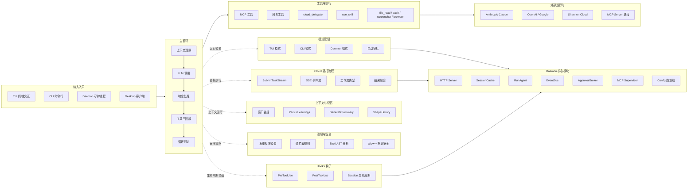
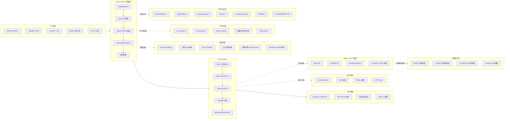

# 图片重画（Mermaid 版）

> 来源：你提供的 3 张截图（ShanClaw 架构图 + Claude Code Runtime 架构图）
> 说明：按可读信息重画了核心结构与主链路；极小字号注释做了语义归并。

## 1) ShanClaw 智能体循环架构（重画）

---

## 2) Claude Code Agent Runtime（重画）

---

## 3) 对齐 Velaris 的映射建议

- `Query Loop` 对齐 `Goal/Policy/Team` 三层：输入解析、策略选择、角色编排。
- `Tool Runtime + Permission` 对齐 `Control/Authority`：执行生命周期 + 审批治理。
- `State + Context` 对齐 `Evaluation`：把每次策略结果沉淀到 Outcome 回放。
- `Cloud Delegate / Agent Task` 对齐 `delegated_openclaw / delegated_claude_code / hybrid` 路由策略。

